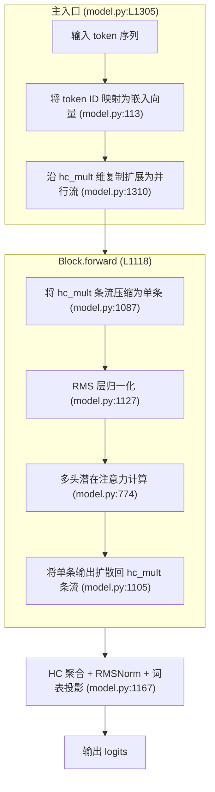

# 脉络镜 — Module Context Insight

When asked to analyze a module's context in the project, perform the following steps.

## Parameters

- **`module`** (required): Module/class name to analyze, e.g.
  `GroupedLinear`, `LayerNormLinear`, `fp8_autocast`, `Transformer`.
- **`target_repo`** (optional): GitHub repository to compare against, in
  `owner/repo` format (e.g. `NVIDIA/TransformerEngine`). When provided, the
  skill fetches the corresponding source file from that repo and performs a
  structural comparison. When omitted, sections 8-9 (gap analysis) are
  skipped entirely.

## 1. Locate Module Source

1. Take the `module` parameter value (module/class name).
2. Search the source tree for the definition:
   - Search `class <Name>` or `def <name>` in all `*.py` files under the
     project source root. Use the project's primary source directory
     (e.g. `transformer_engine/`, `src/`, or project root).
3. Read the primary definition file (the one with the class/function body).
4. If the file contains multiple classes/functions, list all of them with
   their line ranges in a table for an overview.

## 2. Trace Import Chain

Map how the module reaches the public API:

1. Find all `__init__.py` files that export the symbol:
   - Search for the name in all `__init__.py` files.
   - If no `__init__.py` exists (flat project), trace direct imports.
2. Trace step by step from the definition file up to the top-level entry point.
3. List the full import path chain, e.g.:
   ```
   model.py  (definition: Transformer, Block, Attention, ...)
   └→ generate.py  (from model import Transformer, ModelArgs)
   ```
   If no `__init__.py`, note this and show direct imports instead.

## 3. Analyze Class Hierarchy

1. Read the `class` definition line to get all base classes.
2. For each base class, find its definition file and list key responsibilities.
3. Present the inheritance chain:
   ```
   Transformer
   └→ nn.Module  (PyTorch base)

   MTPBlock
   └→ Block
      └→ nn.Module
   ```

## 4. Detail Constructor Parameters

1. Read the `__init__` method and extract every parameter with its type annotation and default value.
2. For each parameter, add a concise explanation in Chinese of its purpose (derived from docstrings or code context).
3. Identify which parameters affect forward behavior, memory usage, parallel strategy, etc.
4. Present in a table format:

   | 参数 | 类型 | 默认值 | 说明 |
   |------|------|--------|------|
   | `num_gemms` | `int` | — | 专家/分组数量 |
   | `in_features` | `int` | — | 输入特征维度 |
   | ... | ... | ... | ... |
5. If the module has a dataclass config (`ModelArgs`-like), also list its key
   fields in a separate table.

## 5. Map Key Methods and Call Flow

1. List all public methods on the class (from reading the file).
2. For the `forward` method:
   - Read the full signature.
   - Summarize the forward logic flow (preprocessing → core computation →
     postprocessing).
   - Identify the `torch.autograd.Function` subclass that implements the
     actual forward/backward (if applicable).
   - Trace every operation: gemm, norm, cast, quantization, dequantization,
     activation functions, residual add, etc.
   - **Generate a detailed Mermaid flowchart** that covers **all code
     branches** in the forward pass. This must include:
     - **Top-level flow first**: show the entry module (e.g. `Transformer`)
       calling into its sub-modules. Use one top-level subgraph for the
       outer forward method.
     - **Every sub-module as a separate subgraph**: decompose each major
       component (Attention, MoE, Block, Compressor, Indexer, Head, etc.)
       into its own labeled subgraph with its entry function annotated.
     - **Every conditional branch**: `if/else`, `torch.where`, tensor shape
       checks, dtype checks, feature flag gates (e.g. FP8/FP4 enabled,
       tensor parallelism on/off, compress_ratio > 0, overlap mode,
       prefill vs decode, hash routing vs score routing, etc.). Each branch
       must be a distinct path in the flowchart with its label on the edge.
     - **Every tensor transformation**: each cast, reshape, permute,
       transpose, split, cat, and slice along the data path.
     - **All kernel / operator invocations**: GEMM, RMSNorm, softmax,
       activation (ReLU, GELU, SiLU, SwiGLU, etc.), residual add, all-reduce,
       all-gather, Hadamard transform.
     - **Subgraph decomposition for fused ops**: if multiple operations are
       fused into one kernel, break the subgraph into nodes for each logical
       step and annotate the kernel name.
     - **Error / early-return paths**: guard clauses that return early
       (shape mismatch, empty tensor, skipped compression).
     - **In-place mutation**: mark nodes where tensors are modified in-place
       (`.copy_()`, `.add_()`, etc.) with a distinct style.
     - **Node labels and edge labels must be in Chinese** — all descriptions
       within the flowchart must use Chinese. Code identifiers, type names,
       and file paths remain in English.
     - **Annotate every node with file location**: for each important node
       (kernel call, branch condition, tensor transformation, sub-module
       entry), append the file path and line number in parentheses, e.g.
       `[FP8 量化 (kernel.py:105)]` or `[低秩 Q 投影 (model.py:788)]`.
       This helps readers jump directly to the relevant code.
     - **Connect subgraphs via edges**: show data flow between subgraphs
       (e.g. `Transformer → Block → Attention → Compressor`). Use labeled
       edges to show tensor shapes where informative.
      - **Node label format**: Each node must use **Chinese to describe the
        semantic meaning** of the operation, not literal code. Append the
        source location as `(file.py:nnn)` at the end of the label. For
        example:
        - ✅ 正确: `"将 token ID 映射为嵌入向量 (model.py:113)"`
        - ✅ 正确: `"对非 rope 维度做 FP8 量化模拟 (model.py:803)"`
        - ❌ 错误: `"h = self.embed(input_ids) → [b,s,d] (model.py:113)"`
        - ❌ 错误: `"act_quant(kv[..., :-rd], 64, ...) (model.py:803)"`
      - Example structure (your flowchart must be significantly more detailed
        and include all branches):
        ```mermaid
        flowchart TD
            subgraph Transformer["主入口 (model.py:L1305)"]
                A["输入 token 序列"] --> B["将 token ID 映射为嵌入向量 (model.py:113)"]
                B --> C["沿 hc_mult 维复制扩展为并行流 (model.py:1310)"]
            end
            subgraph Block["Block.forward (L1118)"]
                direction TB
                D["将 hc_mult 条流压缩为单条 (model.py:1087)"] --> E["RMS 层归一化 (model.py:1127)"]
                E --> F["多头潜在注意力计算 (model.py:774)"]
                F --> G["将单条输出扩散回 hc_mult 条流 (model.py:1105)"]
            end
            C --> Block
            Block --> Head["HC 聚合 + RMSNorm + 词表投影 (model.py:1167)"]
            Head --> H["输出 logits"]
        ```
      - **Validate the generated Mermaid syntax**: after writing the flowchart
       code block, check that node IDs, edge definitions, subgraph boundaries,
       and direction declarations are all syntactically valid. Common pitfalls:
       node IDs with spaces (must be quoted), mismatched subgraph brackets,
       missing direction declaration (`TD` / `LR` / `BT`). Fix any issues found.
3. For the `backward` method (if inside an `autograd.Function`):
   - List all gradient computations (dgrad, wgrad, act grad).
   - Note any gradient accumulation, gradient scaling, or sparse gradient
     handling.
   - Optionally add a backward subgraph to the flowchart if the logic is
     sufficiently complex to warrant it.
4. For other key methods (`reset_parameters`, `hc_pre`, `hc_post`,
   `get_logits`, `overlap_transform`, etc.):
   - List them with a one-line summary of what they do in Chinese.

## 6. Identify Related Modules and Dependencies

1. Search for imports of this module across the codebase:
   ```
   grep -r "from.*import.*<Name>" --include="*.py" <project_root>/
   grep -r "import.*<Name>" --include="*.py" <project_root>/
   ```
2. Also search in `tests/` to find test files.
3. Identify:
   - **调用方**: which modules use this class.
   - **内部依赖**: what ops/layers this module imports and uses (including
     custom CUDA/TileLang kernels from sibling files).
   - **测试文件**: corresponding test files and key test functions.
   - **备选实现**: alternative code paths (e.g. BF16 vs FP8 vs FP4 quantization
     paths, different routing strategies).

## 7. Identify Distant Relatives (跨文件/模块关联)

1. Search for the module's key method names being called from other files.
   Use patterns specific to the analyzed module rather than hardcoded names.
2. Search for configuration/constant references related to this module.
3. Look for any `isinstance` checks or type dispatch that references this class.
4. If the module is the top-level model (e.g. `Transformer`), note all
   external entry points (e.g. `generate.py` calling `model.forward()`).

## 8. Reference & Gap Analysis (与目标仓库对标分析)

If `target_repo` was not provided, **skip this section and section 9 entirely**
— the analysis ends at section 7.

Otherwise, compare the local implementation against the specified target
repository to identify missing features, implementation gaps, and optimization
opportunities.

### 8.1 Locate Reference Path

1. Read the module file's docstring / header comments for a `Reference:` line.
2. If no reference is found, infer the equivalent path by matching the module
   name against the target repo's source tree:
   ```
   https://api.github.com/repos/<target_repo>/contents/<directory>
   ```
   to find the closest equivalent file (by class name or file name).

### 8.2 Fetch Remote Source

1. Fetch the corresponding source file from the target repository:
   ```
   https://raw.githubusercontent.com/<target_repo>/main/<reference-path>
   ```
   - Try `main` branch first; if that fails (404), try `stable` or the latest
     release tag.
   - Use `webfetch` to retrieve the raw content.
2. If the exact file doesn't exist at the expected path, search the target
   repo structure:
   ```
   https://api.github.com/repos/<target_repo>/contents/<directory>
   ```
   to find the closest equivalent.
3. If the remote fetch fails (no network, rate limit), note this limitation
   and skip to section 8.4 (manual comparison based on codebase knowledge).

### 8.3 Structural Comparison

Compare the local and remote versions across these dimensions:

1. **Class hierarchy**: Same base classes? Different MRO?
2. **Constructor parameters**: Compare every `__init__` param side by side:
   - Parameters present in remote but missing locally → **feature gap**
   - Parameters with different defaults → **behavior divergence**
   - Parameters with different types → **porting issue**
3. **Public methods**: List remote methods not present locally → **missing
   implementation**
4. **Forward signature**: Same input/output contract? Different return types?
5. **Advanced features**: The remote repo may have newer features (e.g.
   quantization modes, kernel variants) not yet ported.
6. **Autograd function**: Compare inner `torch.autograd.Function`
   implementations — the forward/backward logic differences reveal the core
   porting delta.

### 8.4 Categorize Deltas

Classify each difference into:

| Category | Label | Description |
|----------|-------|-------------|
| **Missing Feature** | 🔴 GAP | Remote has a feature/param/method that local lacks |
| **Behavior Divergence** | 🟡 DIVERGE | Same interface but different logic or defaults |
| **Local Adaptation** | 🔵 ADAPT | Intentional change for local hardware/requirements |
| **Optimization Opportunity** | 🟢 OPT | Remote uses a more efficient approach to adopt |
| **Deprecated / Removed** | ⚪ CLEANUP | Remote removed something local still carries |

### 8.5 Optimization Suggestions

Based on the comparison, recommend specific actions:

1. **Port missing features**: List each 🔴 GAP with effort estimate and priority.
2. **Align divergent behavior**: For each 🟡 DIVERGE, suggest whether to align
   with remote or keep the local adaptation.
3. **Adopt newer patterns**: For each 🟢 OPT, describe the approach.
4. **Remove dead code**: For each ⚪ CLEANUP, point to relevant commits.

## 9. Output Report

If `target_repo` was not provided, omit sections 8-9 from the report.

Present findings in the following structure in Chinese (code identifiers and technical terms remain in English):

```
## 脉络镜: <ModuleName>

### 1. 源文件定位
<file_path>（共 <N> 行）
| 类/函数 | 行号范围 | 说明 |
|---------|----------|------|
| ... | ... | ... |

### 2. 导入链
<full import chain>

### 3. 类继承关系
<inheritance tree>

### 4. 构造参数详情
| 参数 | 类型 | 默认值 | 说明 |
| ... | ... | ... | ... |

### 5. 核心方法 & 调用流程
#### 5.1 方法总览
| 方法 | 行号 | 说明 |
|------|------|------|
| ... | ... | ... |

#### 5.2 forward 数据流
<signature and logic overview in Chinese>



#### 5.3 其他关键方法
- `<method> (L<nnn>)`: <one-line Chinese description>

### 6. 关联模块 & 依赖
- **调用方**: <files that import this module>
- **内部依赖**: <what ops/layers this module uses, including custom kernels>
- **测试文件**: <corresponding test files>
- **备选实现**: <alternative code paths if any>

### 7. 跨文件关联
<references to this module's methods from other parts of the codebase>

### 8. 对标分析 (仅当指定了 target_repo 时)
#### 8.1 参考源
<remote source URL or path>

#### 8.2 结构对比

| 对比维度 | 本地 | 远程 | 差异 |
|----------|------|------|------|
| 基类 | ... | ... | ... |
| 构造参数数 | ... | ... | ... |
| 公开方法数 | ... | ... | ... |
| 子模块数 | ... | ... | ... |
| 高级特性 | ... | ... | ... |

#### 8.3 参数差异明细
| 参数 | 本地默认值 | 远程默认值 | 差异类型 | 说明 |
|------|-----------|-----------|----------|------|
| ... | ... | ... | 🔴 GAP / 🟡 DIVERGE / ... | ... |

#### 8.4 方法差异明细
| 方法 | 本地 | 远程 | 差异类型 | 说明 |
|------|------|------|----------|------|
| ... | 有 | 有 | — | 实现不同 |
| ... | 无 | 有 | 🔴 GAP | 缺失 |
| ... | 有 | 无 | ⚪ CLEANUP | 可清理 |

#### 8.5 优化建议
- [🔴] <priority>: <suggestion>（附参考行号）
- [🟢] <priority>: <suggestion>（附参考行号）

### 9. 总结
<brief summary of the module's role in the project and optionally the key gaps>
```

### Flowchart Checklist (before submitting)

- [ ] Every sub-module has its own `subgraph` with a Chinese label
- [ ] All conditional branches shown as diamond nodes with edge labels
- [ ] Every important node annotated with `(file.py:Lnnn)` location
- [ ] Node and edge labels use Chinese descriptions (code IDs stay English)
- [ ] Subgraphs connected via edges to show data flow direction
- [ ] Mermaid syntax validated (no unquoted spaces, balanced brackets)
- [ ] Branch diamonds use explicit `-- 是 -->` / `-- 否 -->` labels
- [ ] Tensor transformations (reshape, permute, split, cat) are shown
- [ ] In-place mutations marked with distinct style (e.g. `[原地修改]` prefix)
